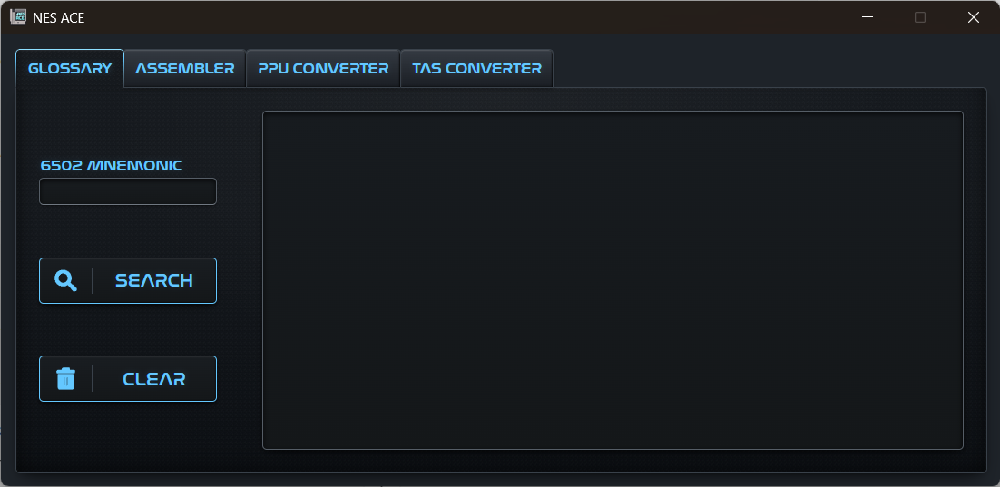
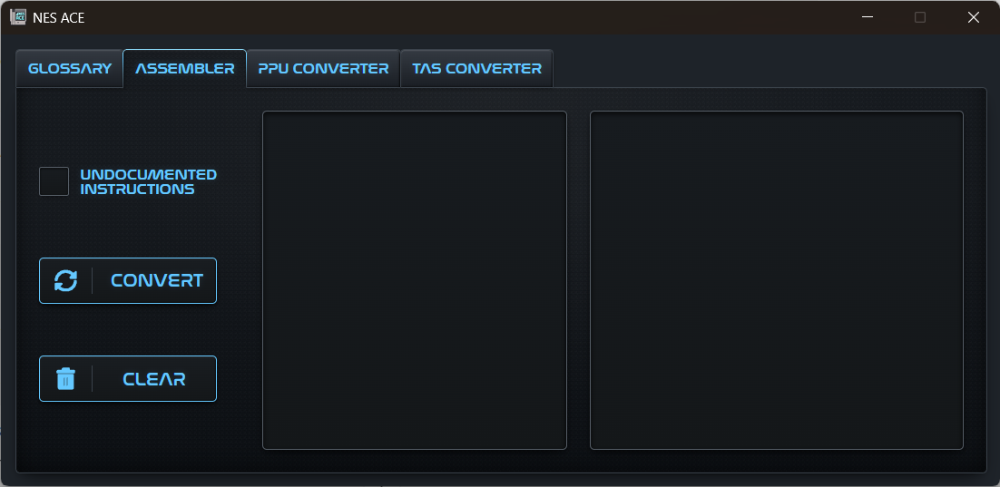
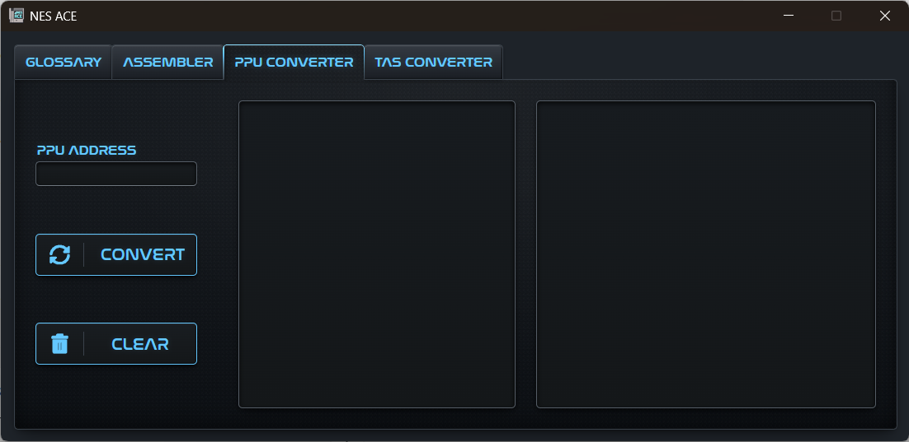
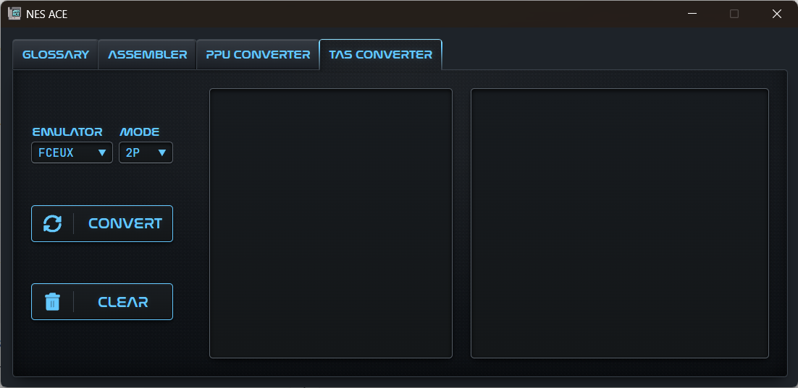

# Introduction

This is a tool that has evolved many times over the last 4 years or so. I was inspired around the summer of 2022 to attempt a Super Mario Bros. 3 Total Control TAS utilizing the DPCM audio workaround bug to achieve total control from the title screen rather than through 7-1. The ultimate goal was to make a follow up or  "true ending" to the TAS made by Lord Tom back in 2016.

This tool did not need to become as optimized/polished as it is, but I started becoming as passionate about the tool as the TAS itself, and my hope is that someone who wants to make a similar TAS someday will have their life made easier because of it.

If you are interested, check the `Extra\` folder to see the 6502 ASM scripts this tool was based off of, or the python scripts which were the **VERY** humble beginnings of this project, including the first script that required hand assembling the ASM, and the first version of a true assembler. This tool has been through many iterations, and I am very proud to call this (more or less) the final version.

Enjoy!

--Binski

# NES ACE

The application provides four tools in one fixed-size desktop window:

**Glossary**
- Looks up 6502 instructions by mnemonic/alias
- Provides information on aliases, flags, and the opcode/length/cycles for each mode
- Searches both documented and undocumented instructions

**Assembler**
- Assembles source 6502 ASM into byte code
- Highlights and denotes errors by type and line number for easy correction
- Separates segments on .org and builds headers into byte code used by total control program
- Supports case-sensitive labels ("A" and "a" not accepted as symbols because of clash with accumulator instruction mode)
- Supports .const, .byte and .word/.addr directives
- Supports hexadecimal ($) binary (%) and decimal values
- Supports low/high byte selection with <> (symbol assumed word width unless made explicit with <>)
- Generates SubNESHawk inputs ready to be pasted into TASStudio

**PPU Converter**
- Converts text payloads into byte code based on NES pattern table data
- Displays error if PPU payload falls outside nametable range or exceeds length of pre-defined RAM buffer
- Warns user if payload will not wrap correctly on the screen or if it isn't possible for the current payload to be wrapped correctly
- Provides payload that will wrap correctly based on starting address if possible
- Generates header/footer bytes used by PPU writing program
- Generates SubNESHawk inputs ready to be pasted into TASStudio

**TAS Converter**
- Converts FCEUX or NESHawk controller input into SubNESHawk input
- Used to TAS gameplay in real time to reduce TAS workload by 5x
- Reads empty frames as lag and converts 1:1 rather than 5:1

It should be noted that this tool is built specifically for SMB3 and the total control/PPU writing programs that I have written and are loaded in RAM for my SMB3 total control TAS. Note that if you want to TAS a different game, editing the source will be required.

## Screenshots

### Glossary



### Assembler



### PPU Converter



### TAS Converter



## Supported Platform

NES ACE targets **64-bit Windows 10 and Windows 11 only**. Electron Forge produces a Squirrel.Windows installer and a portable Windows ZIP archive. macOS and Linux packages are not configured.

## Repository Layout

```text
NES ACE/
├── Extra/
│   ├── Python/                 Earlier Python versions and utilities
│   └── Total Control/          Reference ASM programs used by the project
├── Screenshots/                Interface images displayed in this README
├── Source/
│   ├── assets/                 Application icon used by Electron and Forge
│   ├── backend/
│   │   ├── cmd/                Optional command-line test bed
│   │   ├── glaze/              Vendored Glaze headers
│   │   ├── nes_ace/            C++26 library source and headers
│   │   ├── build_backend.bat   Electron backend build and package staging
│   │   └── typescript_link.cpp Electron-to-C++ JSON bridge
│   ├── src/                    Electron and TypeScript source
│   ├── forge.config.ts         Windows-only Electron Forge configuration
│   ├── package.json            npm scripts and dependencies
│   └── package-lock.json       Reproducible dependency lockfile
├── Test/                       Stress tests, fixtures and expected output
├── .gitignore
├── LICENSE
├── README.md
└── setup.bat                   Automated first-time Windows setup
```

## Build and Start on a New Windows Computer

These steps assume a stock 64-bit Windows 10 or Windows 11 installation with no existing development environment.

### 1. Obtain the Source

Clone the repository from Command Prompt:

```bat
git clone https://github.com/8inski/NES-ACE.git
cd NES-ACE
```

If Git is missing, install it through WinGet first:

```bat
winget install --id Git.Git --exact --source winget --accept-package-agreements --accept-source-agreements
```

Alternatively, use GitHub's **Code > Download ZIP** option, extract it, and open Command Prompt in the extracted repository root.

### 2. Run Automated Setup

From the repository root:

```bat
setup.bat
```

The setup script:

1. Confirms that Windows is 64-bit
2. Checks for Node.js 22.12 or newer and npm
3. Installs the current Node.js LTS release through WinGet when required
4. Checks for MinGW-w64 GCC 16.1 or newer
5. Installs and updates MSYS2 when required
6. Installs or repairs the MSYS2 UCRT64 compiler and its required packages
7. Compiles and runs a C++26 smoke test before accepting the toolchain
8. Runs `npm ci` inside `Source\`

Glaze is already vendored under `Source\backend\glaze`; no separate C++ library installation is required. When setup succeeds, Command Prompt is moved into the `Source\` directory.

### 3. Start NES ACE

After setup completes:

```bat
npm start
```

`npm start` runs `backend\build_backend.bat` first, then launches Electron. This ensures the executable always matches the current C++ source when running the project from source.

`npm start`, `npm run package`, and `npm run make` invoke `backend\build_backend.bat` automatically. Developers can run the batch file directly from `Source\` when they need to compile and stage the C++ backend without launching or packaging Electron.

## Manual Setup

Install the following tools:

- Node.js 22.12.0 or newer, including npm
- MinGW-w64 GCC 16.1 or newer
- MinGW-w64 Binutils, including `objdump`
- `strip`, recommended but optional

The GCC requirement is intentional. The backend uses modern standard-library facilities including `std::inplace_vector`, `std::flat_map`, `std::expected`, `std::print`, `std::format`, and range views.

From the repository root:

```bat
cd Source
npm ci
npm start
```

Use `npm install` instead of `npm ci` only when intentionally updating dependencies or regenerating the lockfile.

## Optional Command-Line Test Bed

The command-line program is not required by the Electron application and is not built by `setup.bat`.

From `Source\`:

```bat
backend\cmd\build_cmd.bat
backend\cmd\cmd_test.exe
```

Benchmark mode (no results displayed, only execution times, summary upon quit):

```bat
backend\cmd\cmd_test.exe -b
```

The test fixtures and expected outputs are stored under `Test\`.

## Create Windows Distributables

From `Source\`, create an unpacked application:

```bat
npm run package
```

Create the Windows installer and portable ZIP:

```bat
npm run make
```

Both commands rebuild and stage the backend before invoking Electron Forge. Generated output is written to:

```text
Source\out\
```

Completed release packages include Electron, `backend.exe`, and any runtime DLLs still required by that executable. End users do not need Node.js, npm, GCC, or MinGW.

## Development Commands

Run these from `Source\`:

```bat
npm start
npm run lint
backend\cmd\build_cmd.bat
```

## Architecture

```text
Renderer UI
    │
    ▼
Preload context bridge
    │
    ▼
Electron main process
    │
    ▼
Persistent backend.exe child process
    │
    ▼
C++26 NES ACE library
```

- `Source/src/renderer.ts` manages the interface, output formatting, controls, and shortcuts
- `Source/src/assembler-editor.ts` manages the CodeJar editor and error-line highlighting
- `Source/src/backend-api.ts` defines the shared request, response, and preload API types
- `Source/src/preload.ts` exposes a restricted renderer API
- `Source/src/main.ts` validates renderer input and registers IPC handlers
- `Source/src/backend.ts` manages the persistent C++ process and newline-delimited JSON protocol
- `Source/backend/typescript_link.cpp` translates between JSON and the C++ library
- `Source/backend/nes_ace/` contains the assembler, database, glossary, PPU converter, TAS converter, and shared utilities

Electron runs with context isolation enabled and renderer Node integration disabled.

## Generated Files

The following are intentionally excluded from Git:

- `Source/node_modules/`
- `Source/.vite/`
- `Source/out/`
- `Source/dist/`
- `Source/packaging/`
- `Source/backend/backend.exe`
- `Source/backend/cmd/cmd_test.exe`
- compiled `.dll`, `.o`, `.obj`, `.pdb`, and related artifacts

These files are regenerated by npm, the supplied C++ build scripts, or Electron Forge.

## License

NES ACE is available under the MIT License. See `LICENSE` for details.
